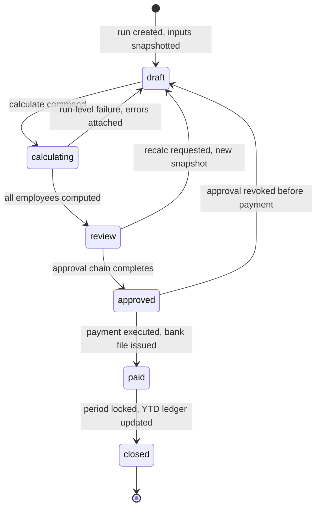

# ADR-0012: Payroll Calculation Engine

Status: Accepted · Date: 2026-08-01 · Deciders: product owner + engineering (spec §10, confirmed Phase 0)

## Context

Payroll must compute Indonesian statutory payroll (PPh 21 TER monthly + December/exit recalculation, BPJS Kesehatan + Ketenagakerjaan, THR, overtime on the 1/173 basis, proration, final settlement) for up to 10,000 employees per tenant in under 30 minutes as background jobs (D1), with every rate/cap as effective-dated configuration, never hardcoded (spec §4.4). Runs feed money movements — results must be reproducible, explainable, and auditable years later (D4: ≥10 years). This ADR fixes the engine architecture; `docs/06-modules/payroll.md`, `tax-pph21.md`, `bpjs.md` own the concrete rules and formulas.

> ⚠️ VERIFY: confirm against current Indonesian regulation before implementation. — applies to every statutory mechanism referenced here; the engine treats all of them as effective-dated parameters.

## Decision

### Component model

A payroll component is typed configuration, per tenant/company, effective-dated:

- Kind: `earning | deduction | employer_cost` (`employer_cost` added 2026-08-03, bpjs.md — amendment 4, see below); cadence: `recurring | one_off`; source: `fixed_amount | rate_of_base | calculator_ref | run_input`.
- Statutory attributes: **two orthogonal classification axes** (amended 2026-08-02, payroll.md — this replaces "PPh 21 object classification + inclusion flags per BPJS contribution base"). `wage_category ∈ {basic, fixed_allowance, variable_allowance, non_wage}` decides membership in statutory **wage** bases; `income_class ∈ {regular, irregular, non_taxable, final}` decides **tax** treatment (`final` added 2026-08-03, tax-pph21.md — amendment 3, see below). Every statutory base — `upah sebulan`, each BPJS contribution base, the THR base, the overtime hourly basis with its 75% floor — is a **code-owned formula over categories**, not a set of per-component opt-ins. The tenant classifies each component once, in the statute's own vocabulary; which categories a base sums is law, and law does not vary per tenant. Per-base booleans were rejected because they make a silent underpayment expressible as valid configuration (JHT ticked, JP forgotten) and because a floor that compares two bases cannot be represented as a property of any one component. Plus: proratable flag, rounding rule ref.
- `calculator_ref` points at a **code-registered calculator** (overtime, BPJS parts, PPh 21) — there is no user-defined formula DSL. Tenants compose components; statutory math is code.
- Employee assignment = effective-dated salary history (database-conventions §5); run-time inputs (approved overtime hours, reimbursements, ad-hoc adjustments) enter as `run_input` components. **`run_input` names the component class, not the transport** (clarified 2026-08-02, overtime.md): overtime, leave, and **expense** effects are **pulled** from their owning modules' ports at snapshot time, while ad-hoc adjustments are entered directly (the example list is corrected in place 2026-08-03, expense-reimbursement.md — reimbursements were listed as directly entered, but payroll.md §4.4 has declared `ExpenseQueryPort` since 2026-08-02 and the module now serves it; a stale example, not a decision change, so no amendment). No module pushes rows into a run — the module that owns the period owns when its inputs are read, and a push model would let a module write into a run whose period is already frozen.

### Snapshot-based deterministic calculation

Run creation **snapshots every input**: employee roster for the period, salary as-of, attendance summary, approved overtime/leave effects, component definitions, and the effective-dated parameter versions (TER tables, PTKP, BPJS rates/caps, overtime divisor). Calculation is a pure function of the snapshot: same snapshot → identical output, forever.

**Amendment 3 (2026-08-03, tax-pph21.md), in place — extension, no reversal, so no supersession (same precedent as amendments 1 and 2).** Two additions:

1. **`income_class` gains `final`.** PPh 21 on severance and comparable lump sums is a *final* tax on its own tariff; it does not enter the monthly withholding base and does not enter the annual recalculation. With only `{regular, irregular, non_taxable}` there was no correct classification for such a component — `irregular` priced it progressively and corrupted the December figure, `non_taxable` under-withheld a tax genuinely owed. Wrong-by-configuration was expressible, which is the same defect amendment 1 removed from the wage axis. `final` amounts accumulate in their own YTD columns (`final_income_ytd`, `pph21_final_ytd`) and are excluded from `taxable_regular`/`taxable_irregular`. Severance *entitlement* calculation remains out of scope.
2. **The calculator input carries a month-to-date slice beside the year-to-date one.** TER is a rate on a month's total bruto, and two runs may legitimately share a payment month (a THR run beside a regular one; a final settlement beside either). Pricing each run on its own gross places the month in a lower band than it belongs in. The MTD slice — bruto and PPh 21 already withheld this tax month, from runs at `approved` or later — is assembled by payroll at snapshot and passed *in*, exactly as the YTD slice is and for the same reason: a callback would make the pipeline order-dependent on live state. Determinism additionally requires that a run not enter `calculating` while another run for the same company and payment month sits in `calculating` or `review`. Each employee's result stores a full **calculation trace** (jsonb: bases, per-component amounts, tax steps, parameter versions used) — the payslip's explain-view and the auditor's evidence.

**Amendment 4 (2026-08-03, bpjs.md), in place — extension, no reversal, so no supersession.** **Component `kind` gains `employer_cost`.** The employer's share of a statutory contribution is neither an earning nor a deduction: it never reaches the employee's net pay, and it is not withheld from anything. Before this value the entire employer side had no line representation at all — only two scalar totals — while this ADR's own pipeline already promised "BPJS employee/employer parts" as a stage output. The value is load-bearing rather than cosmetic, because **some employer-paid premiums are taxable income to the employee** (bpjs.md BR-BPJS-011 ⚠️ VERIFY): the tax calculator's only view of income is its `lines` argument, so a premium that is not a line is a premium missing from bruto, permanently and invisibly, on every payslip and every Form 1721-A1. Carrying the premiums as lines lets the **existing** `income_class` axis answer "does this enter the employee's taxable base" with no new concept — employer Kesehatan, JKK and JKM classify `regular`, employer JHT and JP classify `non_taxable`, and all five are `non_wage` so they move no wage base. Two invariants are stated explicitly because they are what the value must not break: **net pay is `Σ earning − Σ deduction`, with `employer_cost` outside both**, so payroll's "the payslip foots" rule (BR-PAY-012) is unchanged; and **taxable assembly sums `earning` and `employer_cost` lines by income class**, deduction lines never. Any consumer aggregating run lines must filter by kind or it will report the employer's own costs as employee gross.

Pipeline order is fixed in code: gross earnings → overtime → prorations → BPJS employee/employer parts → taxable-income assembly (regular/irregular split) → PPh 21 (TER monthly; December/exit path runs the annual recalculation) → deductions → net → rounding. Tax and BPJS calculators are pipeline stages owned by their modules (ADR-0001 boundaries): payroll orchestrates; `tax-pph21`/`bpjs` calculate. The BPJS stage sitting **before** taxable assembly is not incidental ordering: it is what makes amendment 4's taxable employer premiums reach the tax base at all. The BPJS stage also reads the **stage-1, unprorated** `upah sebulan` rather than stage 3's output, because the contribution base is a reported wage rather than a payment (bpjs.md BR-BPJS-007 ⚠️ VERIFY).

### Run lifecycle

Run types: `regular | thr | final_settlement` — one engine, type-specific eligibility/proration rules in the payroll module doc.

- `review → approved` goes through the approval engine (request type `payroll_run`, ADR-0008) — payroll approval is a chain, not a button.
- Per-employee calculation failures do **not** kill the run: the employee row is marked errored, the run reaches `review` with an error subset for fixing + selective recalc.
- **`closed` is terminal.** No reopen. Post-close corrections are retro adjustments in a later run.
- Period locking is a **precondition** of `calculating`, not an effect of it (clarified 2026-08-02, payroll.md — the earlier wording "binds at `calculating`" read as payroll causing the lock, which contradicted attendance.md's grilled rule that a run reaches `calculating` only over an already-locked period). Attendance owns the period: its table, its UI, its audit trail, and the `PeriodLockPort` six modules read. Payroll verifies the lock and never writes attendance state; the reverse guard, `PayrollRunGuardPort.runsOver`, blocks release while a non-draft run exists. Both directions are read-only across the boundary. THR runs are exempt — they consume no attendance facts.

### Execution (BullMQ `payroll` queue, fail-fast class — ADR-0010)

Parent job chunks employees (~100/batch) into parallel child jobs across workers; progress = computed/total surfaced live; results keyed `(runId, employeeId)` so re-execution overwrites draft results idempotently. Company-level aggregates (totals, bank file sums) compute in a join step after all chunks. Sized against D1: 10k employees / 100-per-batch × parallel workers ≪ 30 min. **That arithmetic is per run, and `performance.md` §2.3 and §7.2 own the fleet reading** *(2026-08-04)*: one million payslips a month across 500 tenants, concentrated on Indonesian payroll dates, against **one shared `payroll` queue whose concurrency `ADR-0010` deliberately keeps low** — so month-end runs wait behind each other and nothing here bounds how deep that gets. Three consequences recorded there: a concurrent-run admission bound; **two clocks**, since D1's 30 minutes is *processing* time and queue wait is separate and separately reported (a run that waited three hours reports 25 minutes and looks healthy); and the fact that the whole budget rests on **per-employee calculation CPU cost, which nobody has measured** — that file states a starting value and names the rehearsal that replaces it.

### Recalculation strategy

- **Draft/review:** recalc = **new snapshot**, full or selective (subset of employees re-snapshotted and recomputed — late attendance corrections don't force 10k recomputes).
- **Approved, unpaid:** revoke to `draft` (approval chain re-runs). No silent recalcs behind an approval.
- **Closed:** **retro adjustment** — the engine recomputes the affected past period in shadow from a corrected snapshot, diffs against what was paid, and emits delta components into the current run (tax treatment of retro deltas is the tax module's rule, effective-dated).
- **YTD ledger:** per-employee accumulators (gross, taxable regular/irregular, PPh 21 withheld, final income and final tax, BPJS base and totals, and the **employee JHT and JP contributions named separately** — added 2026-08-03, bpjs.md BR-BPJS-017, because those two are the ones the annual PPh 21 path deducts and the combined employee total mixes them with a non-deductible part) update at `closed`. December/exit annual recalculation and Form 1721-A1 read the ledger, never re-sum historical runs.

## Alternatives considered

- **Live calculation without snapshots.** Rejected: inputs drift mid-run (a correction lands while calculating), results become irreproducible, audits unanswerable.
- **User-defined formula DSL.** Rejected: statutory Indonesian payroll is versioned law, not tenant algebra; a DSL invites unauditable money math and injection surface. Calculator registry + component flags cover legitimate variation.
- **Recalc-in-place after approval.** Rejected: numbers behind an approval must be exactly the approved numbers.
- **Event-sourced payroll ledger.** Rejected: snapshot + trace delivers replayability and audit at a fraction of the complexity.
- **Outsourced payroll engine/service.** Rejected: core domain, core differentiator; also data-residency (A-003).

## Tradeoffs

Snapshots and traces cost storage — they are the audit artifact, retained in the payroll 10-year class (database-conventions §4.4), and bounded per run. "What-if" preview requires creating a draft run — acceptable friction; previews that bypass the pipeline lie. Fixed pipeline order means genuinely new statutory stages are code changes — correct: law changes are releases, with effective-dated parameters absorbing the common case (rate/cap updates). Selective recalc adds bookkeeping (which employees are stale) — cheaper than 10k recomputes per correction.

## Consequences

- `docs/06-modules/payroll.md`: run/`run_employee`/payslip-line/YTD/retro schemas, THR + final-settlement rules, bank file, BR-PAY rules, full state-machine detail.
- `docs/06-modules/tax-pph21.md` + `bpjs.md`: calculator contracts (pure functions over snapshot slices), parameter table schemas with VERIFY markers, December/exit recalculation, 1721-A1 from the YTD ledger.
- `docs/05-platform/settings.md`: effective-dated statutory parameter storage the snapshots reference by version.
- Attendance/leave/overtime docs define period-lock semantics feeding the snapshot; approval engine registers `payroll_run`.
- Testing-strategy: golden-file tests — fixed snapshot in, exact payslip out — are the primary payroll test class; determinism makes them stable.

## Future considerations

Correction-only run type (retro batch without a regular cycle) if operations want mid-month fixes. Component marketplace/templates across tenants. Parameter-update tooling that drafts new effective-dated versions when regulations change (the TER-table update workflow). If per-tenant calculators ever become a real demand, they enter as sandboxed calculator plugins with mandatory trace output — via a superseding ADR.
