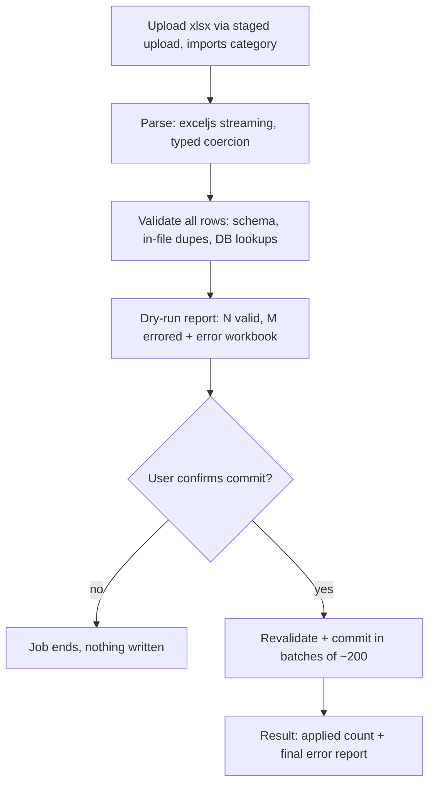

# ADR-0015: Import/Export Framework

Status: Accepted · Date: 2026-08-02 · Deciders: product owner + engineering (D9 confirmed Phase 0)

## Context

D9 puts Excel bulk I/O in V1: bulk employee import with row-level validation reports; payroll, attendance, and report exports; `exceljs` streaming; imports as BullMQ jobs with progress and a downloadable error report. Consumers beyond employee import: holiday yearly import, recruitment/candidate lists, report exports of every module. Indonesian HR operations live in Excel — this framework is a first-class platform module, not a utility. This ADR fixes the pipeline model; `docs/05-platform/import-export.md` (Phase 2) owns schemas, APIs, `IMP_` codes.

## Decision

### Registry of declarative definitions

Modules register code-defined `ImportDefinition`s / `ExportDefinition`s (same registry pattern as ADR-0012 calculators): type key, required permission, column specs (typed, localized headers per D12, validator refs), cross-row/cross-record validators, write mode (`create_only | upsert | update_only` on a declared natural key, e.g. NIK), commit mode (see below), template generator; exports declare a streaming query port + permission-filtered column sets (salary columns demand their permission — ADR-0005 data scope applies to exports too). New import type = code + module doc entry, never tenant-built mappings in V1.

### Import pipeline

- **Dry-run is mandatory, always first.** Commit is a second, explicit step; because data can drift between the two, **commit revalidates everything** — dry-run informs, commit-time validation decides. Same validation code path both times.
- **Commit modes per definition:** `partial` (default — valid rows apply, failed rows land in the error report; a 5k-row file with 12 typos must not block 4,988 employees) or `strict` all-or-nothing (payroll-affecting imports). Batches of ~200 rows per transaction; in partial mode a bad row is isolated, not a batch rollback.
- **Error report** = xlsx mirroring the input with original row numbers + per-row error codes and localized messages; stored via ADR-0009, linked from the job; retention: operational class (database-conventions §4.4).
- **Concurrency guard:** one active import per tenant + type (ADR-0010 natural-key jobId) — no double-commit races.
- **Progress:** job status endpoint (parsed/validated/committed counts), polled by the admin UI; completion notification (in-app, optional email). SSE is a later upgrade, not V1.

### Templates

Downloadable xlsx template per type: localized headers, one example row, hidden sheet with enum values + a **template version marker** — stale template on upload is an immediate, specific error, not fifty mysterious row failures.

### Excel handling rules

- exceljs **streaming** both directions (WorkbookReader / streaming writer) — 20 MB / row-cap (default 10k rows, settings-tunable) stays in bounded memory.
- Typed coercion per column: dates accept ISO strings and native Excel dates (serial), normalized deterministically; decimal parsing is strict per column type (id-ID comma traps); strings trimmed; empty rows skipped; formula cells contribute their cached value only.
- **Only `.xlsx`.** No `.xls`, no `.xlsm` (macros never enter the system). Size/type enforced by the ADR-0009 category.
- **Export injection defense:** cell values starting with `= + - @` are apostrophe-prefixed on export — spreadsheet formula injection is a real exfiltration vector in HR data.

### Exports

Always async jobs (`exports` queue): streaming query (internal cursor) → streaming writer → stored file → notification with signed URL. No inline HTTP exports — one path, no timeout class of bugs. (Client-side "copy current grid page as CSV" in the admin UI is out of framework scope and carries no server guarantee.)

## Alternatives considered

- **SheetJS.** Rejected: weaker streaming story in the open edition, licensing friction; D9 fixed exceljs regardless.
- **CSV as the interchange format.** Rejected: Indonesian locale CSV chaos (semicolon delimiters, comma decimals, encoding); HR ops exchange `.xlsx`. CSV can arrive later as an additional parser behind the same definitions.
- **Synchronous HTTP import/export.** Rejected by D9 and by physics: timeouts and memory spikes exactly on the biggest files.
- **All-or-nothing as the only commit mode.** Rejected: blocks real HR onboarding flows; strict mode exists where money demands it.
- **Tenant-configurable column mapping UI.** Rejected for V1: mapping arbitrary spreadsheets is a product in itself; versioned templates make the contract explicit and supportable.

## Tradeoffs

Validating twice (dry-run + commit) costs CPU on big files — the price of honesty under concurrent edits; it's the same code run twice, not two codebases. Partial commits produce mixed outcomes — the error report *is* the contract, and the job state (`partially_completed`) is explicit, never silent. Registry-not-UI means new import types are engineering work — correct, since row handlers are domain logic anyway. Polling instead of SSE is a deliberate simplicity buy.

## Consequences

- `docs/05-platform/import-export.md`: `import_jobs` state machine (`uploaded → validating → awaiting_confirmation → committing → completed | partially_completed | failed`), definition registry contracts, template versioning, APIs, `IMP_` codes, injection-defense spec.
- Module docs declare their definitions (employee bulk import, holiday yearly import first); their §13 lists import/export touchpoints.
- Queues `imports`/`exports` per ADR-0010 (standard retry; processors idempotent — batch commit keyed by jobId + batch index).
- ADR-0009 categories `import file / error report` consumed; notification module delivers completion messages.
- Testing-strategy: golden import fixtures (file in → exact per-row verdicts out), double-delivery batch tests, injection-defense tests on export.

## Future considerations

SSE/live progress when the admin UX wants it. CSV parser behind the same definitions. Tenant-mapping UI only if template discipline demonstrably fails in the field. Scheduled recurring exports (payroll close → auto bank-file + report bundle) ride the existing definitions + cron fan-out.
